# VideoLingo Core 架构文档

## 📋 目录

1. [项目概述](#项目概述)
2. [系统架构图](#系统架构图)
3. [处理流程详解](#处理流程详解)
4. [UML 图](#uml-图)
5. [模型与技术选型](#模型与技术选型)
6. [数据流图](#数据流图)

---

## 项目概述

VideoLingo 是一个完整的视频本地化处理系统，支持视频下载、语音识别（ASR）、字幕分割、翻译、配音（TTS）、音视频合成等全流程自动化处理。

### 核心功能模块

| 模块编号 | 文件名 | 功能描述 |
|---------|--------|---------|
| Step 1  | `_1_ytdlp.py` | 视频下载（yt-dlp） |
| Step 2  | `_2_asr.py` | 语音识别转录 |
| Step 3.1| `_3_1_split_nlp.py` | NLP句子分割 |
| Step 3.2| `_3_2_split_meaning.py` | 语义分割 |
| Step 4.1| `_4_1_summarize.py` | 内容摘要与术语提取 |
| Step 4.2| `_4_2_translate.py` | 翻译处理 |
| Step 5  | `_5_split_sub.py` | 字幕分割对齐 |
| Step 6  | `_6_gen_sub.py` | 字幕文件生成 |
| Step 7  | `_7_sub_into_vid.py` | 字幕烧录到视频 |
| Step 8.1| `_8_1_audio_task.py` | 配音任务生成 |
| Step 8.2| `_8_2_dub_chunks.py` | 配音分块处理 |
| Step 9  | `_9_refer_audio.py` | 参考音频提取 |
| Step 10 | `_10_gen_audio.py` | TTS 音频生成 |
| Step 11 | `_11_merge_audio.py` | 音频合并 |
| Step 12 | `_12_dub_to_vid.py` | 配音合成到视频 |

---

## 系统架构图

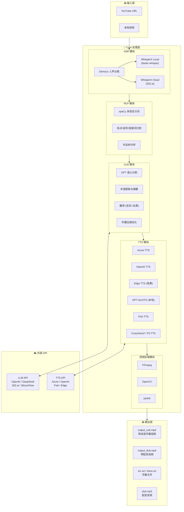

---

## 处理流程详解

### 完整处理流程图

```mermaid
flowchart LR
    subgraph Stage1["阶段一: 预处理"]
        S1["Step 1<br/>视频下载"]
        S2["Step 2<br/>语音识别"]
    end
    
    subgraph Stage2["阶段二: 文本处理"]
        S3_1["Step 3.1<br/>NLP分割"]
        S3_2["Step 3.2<br/>语义分割"]
        S4_1["Step 4.1<br/>摘要提取"]
        S4_2["Step 4.2<br/>翻译"]
    end
    
    subgraph Stage3["阶段三: 字幕处理"]
        S5["Step 5<br/>字幕分割"]
        S6["Step 6<br/>生成字幕"]
        S7["Step 7<br/>烧录字幕"]
    end
    
    subgraph Stage4["阶段四: 配音处理"]
        S8_1["Step 8.1<br/>配音任务"]
        S8_2["Step 8.2<br/>配音分块"]
        S9["Step 9<br/>参考音频"]
        S10["Step 10<br/>TTS生成"]
        S11["Step 11<br/>音频合并"]
        S12["Step 12<br/>配音合成"]
    end

    S1 --> S2 --> S3_1 --> S3_2 --> S4_1 --> S4_2
    S4_2 --> S5 --> S6 --> S7
    S7 --> S8_1 --> S8_2 --> S9 --> S10 --> S11 --> S12
```

### Step 2: 语音识别详细流程

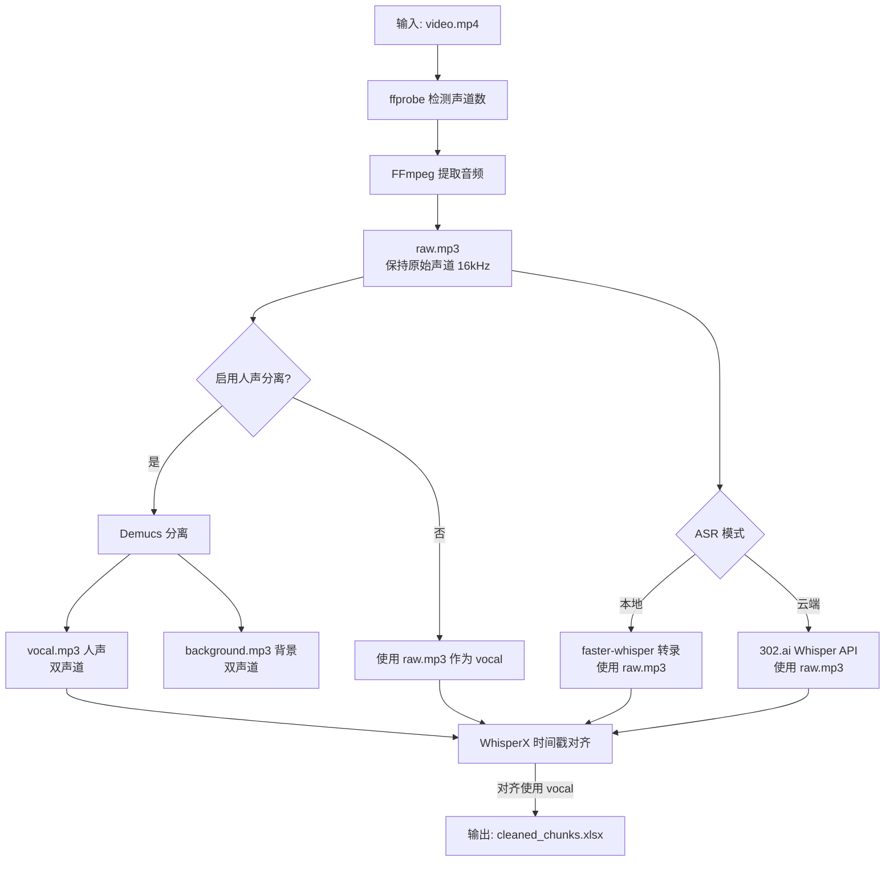

> **说明**: 
> - `raw.mp3` 保持与原始视频相同的声道数（动态检测），比特率 = 32k × 声道数
> - 转录阶段使用 `raw.mp3`，对齐阶段使用 `vocal.mp3`（如果启用了 Demucs）
> - Demucs 输出始终为双声道（模型特性）

### Step 3.1: 文本粗切分（NLP 预处理）

> **📌 注意：这一步不是真正的"分句"，而是文本粗切分**
> 
> Step 3.1 的目的是将 ASR 输出的长文本按**标点、时间间隔、连接词**等规则进行**粗切分**，
> 为后续的语义分割提供较短的文本片段。spaCy 在这里主要用于：
> - **分词（tokenize）**：计算文本长度
> - **依存分析**：识别连接词、词根等语法结构
> 
> **真正的智能分句在 Step 3.2 由 GPT 完成。**

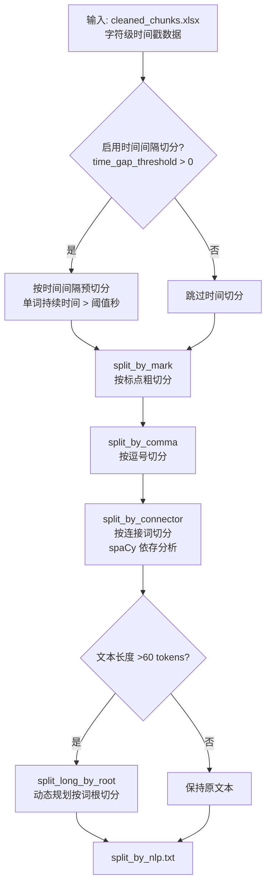

**spaCy 在 Step 3.1 的作用**：

| 功能 | 用途 | 说明 |
|-----|------|------|
| 分词 (tokenize) | 计算文本长度 | 判断是否需要进一步切分 |
| 依存分析 (dep) | 识别连接词 | `that`, `which`, `ので`, `ため` 等 |
| 词性标注 (pos) | 识别词根 | 动词、名词等作为切分点 |
| 句子边界 (sents) | 粗切分 | 仅对有标点的语言有效 |

**时间间隔切分参数**：

| 参数 | 配置键 | 默认值 | 说明 |
|-----|-------|-------|------|
| 时间间隔阈值 | `time_gap_threshold` | 空 (不启用) | 单词持续时间超过此值(秒)时强制切分，日语推荐 1.0 |

> **日语处理优化**：日语口语通常没有明显标点，但 ASR 会在自然停顿处产生较长的单词持续时间。
> 设置 `time_gap_threshold: 1.0` 可以利用这些停顿点进行切分。

**文件流**：

```
cleaned_chunks.xlsx     ← ASR 输出（字符级时间戳）
    ↓ split_by_mark()       按标点/时间粗切分
split_by_mark.txt (临时)
    ↓ split_by_comma_main() 按逗号切分
split_by_comma.txt (临时)
    ↓ split_sentences_main() 按连接词切分
split_by_connector.txt (临时)
    ↓ split_long_by_root_main() 按词根切分超长文本
split_by_nlp.txt        ← Step 3.1 最终输出（粗切分结果）
```

### Step 3.2: 语义分句（GPT 智能分割）

> **📌 这一步才是真正的"分句"**
> 
> Step 3.2 使用 **GPT 进行语义理解**，将粗切分的文本片段进一步分割成**语义完整的句子**。
> spaCy 在这里只用于 **分词（tokenize）** 来计算文本长度，判断是否需要调用 GPT。

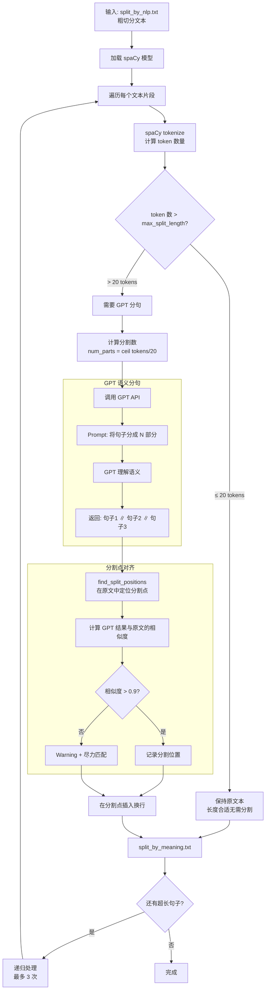

**spaCy 在 Step 3.2 的作用**：

| 功能 | 用途 |
|-----|------|
| **分词 (tokenize)** | 计算文本的 token 数量，判断是否超过阈值需要 GPT 分句 |

> **注意**：Step 3.2 中 spaCy **不做分句**，分句完全由 GPT 完成。

**语义分句关键参数**:

| 参数 | 配置键 | 默认值 | 说明 |
|-----|-------|-------|------|
| 最大分割长度 | `max_split_length` | 日语12 / 其他20 | 超过此 token 数触发 GPT 分句 |
| 时间间隔阈值 | `time_gap_threshold` | 空 (不启用) | Step 3.1 中按时间切分的阈值(秒) |
| 并发数 | `max_workers` | 4 | GPT 请求并发数 |
| 相似度阈值 | - | 0.9 | 分割点定位的最小相似度 |
| 最大重试次数 | - | 3 | 递归处理超长句子的次数 |

**语言模型选择逻辑**:

```python
# init_nlp() 语言选择 - 用于分词
user_language = load_key("whisper.language")      # 用户设置的语言
detected_language = load_key("whisper.detected_language")  # 自动检测的语言
language = user_language if user_language else detected_language

# 映射到 spaCy 模型（用于分词，不是分句）
SPACY_MODEL_MAP = {
    "ja": "ja_core_news_md",
    "en": "en_core_web_md", 
    "zh": "zh_core_web_md",
    ...
}
```

**GPT 分割 Prompt 示例**:

```
请将以下句子分成 3 部分，用 || 分隔:
"高レベルの警戒隠蔽を使うことはヨガラスのカメラを通して見ていたのでなお前が王女につきまとっていると知りサラムの魔眼に似せた仕組みを作らせたのだ"

GPT 返回:
"高レベルの警戒隠蔽を使うことはヨガラスのカメラを通して見ていたので||なお前が王女につきまとっていると知り||サラムの魔眼に似せた仕組みを作らせたのだ"
```

### Step 4.2: 翻译双步骤流程

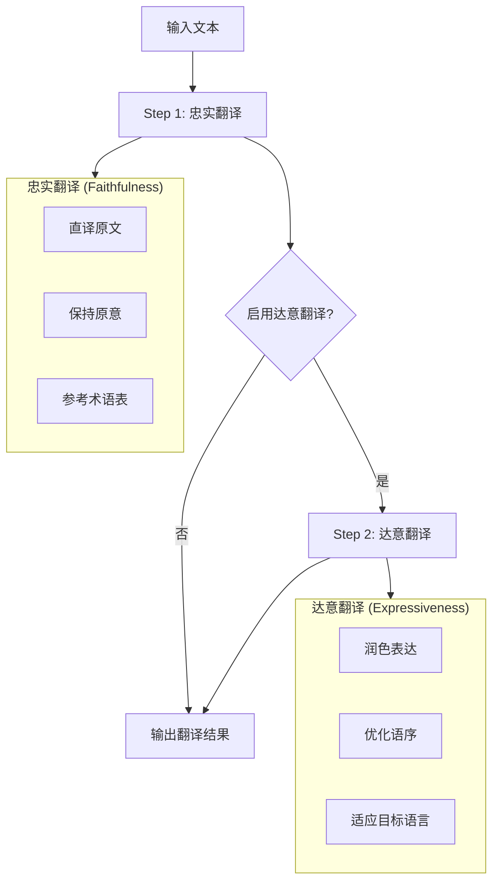

---

## UML 图

### 处理流程序列图

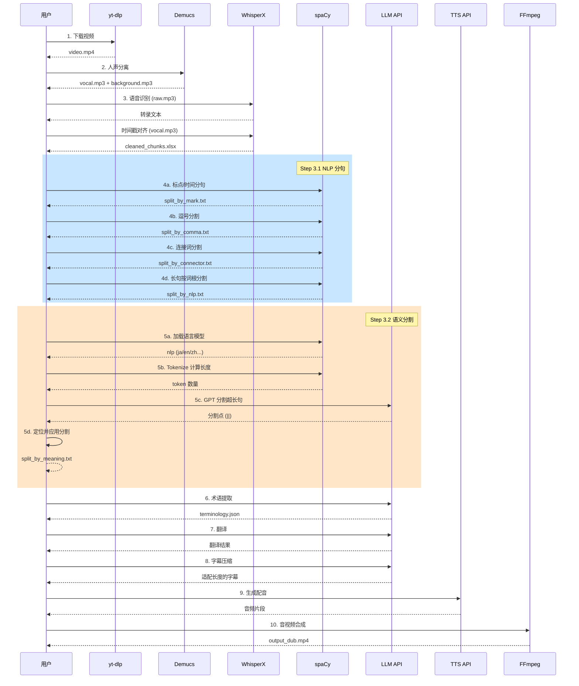

### 模块类图

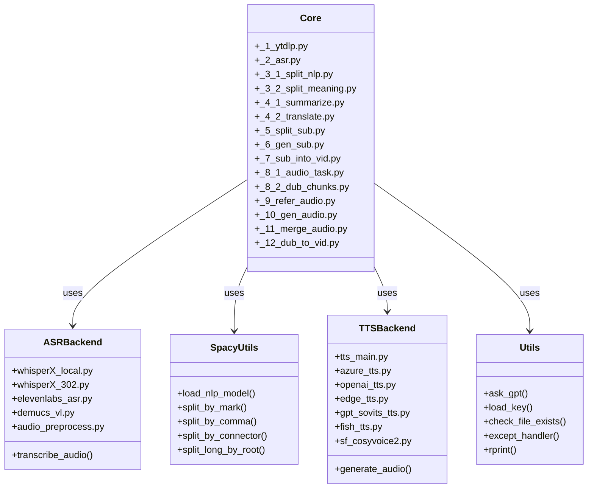

### 状态机图

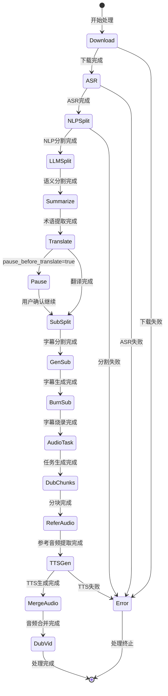

---

## 模型与技术选型

### ASR 模型对比

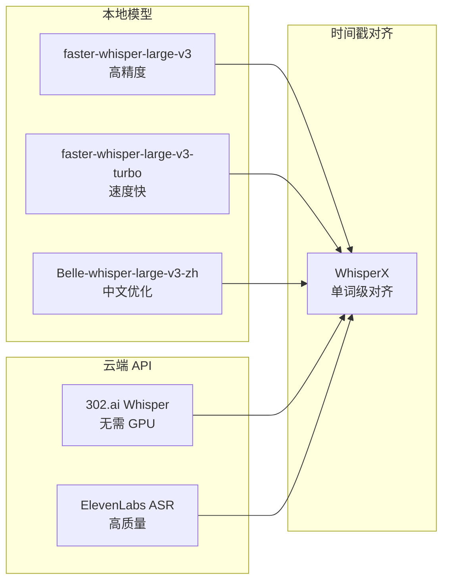

### TTS 功能支持表

| 引擎 | 语言支持 | 声音克隆 | 成本 | API 来源 |
|-----|---------|---------|------|---------|
| **Azure TTS** | 100+ | ❌ | 付费 | 302.ai |
| **OpenAI TTS** | 多语言 | ❌ | 付费 | 302.ai |
| **Edge TTS** | 多语言 | ❌ | 免费 | 微软 |
| **GPT-SoVITS** | 多语言 | ✅ | 本地部署 | 本地 |
| **Fish TTS** | 中/英 | ✅ | 付费 | 302.ai / SiliconFlow |
| **CosyVoice2** | 中/英 | ✅ | 付费 | SiliconFlow |
| **F5-TTS** | 多语言 | ✅ | 付费 | 302.ai |

### NLP 模型支持

| 语言 | spaCy 模型 | 用途 |
|-----|-----------|------|
| English | `en_core_web_md` | 分词、句法分析 |
| Chinese | `zh_core_web_md` | 中文分词 |
| Japanese | `ja_core_news_md` | 日文分词 |
| German | `de_core_news_md` | 德文分词 |
| French | `fr_core_news_md` | 法文分词 |
| Spanish | `es_core_news_md` | 西班牙文分词 |

---

## 数据流图

### 文件数据流

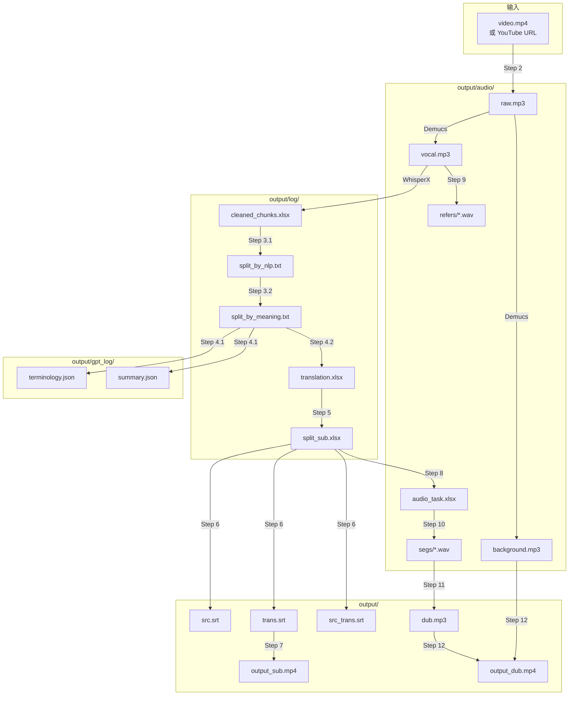

### 配置参数关系图

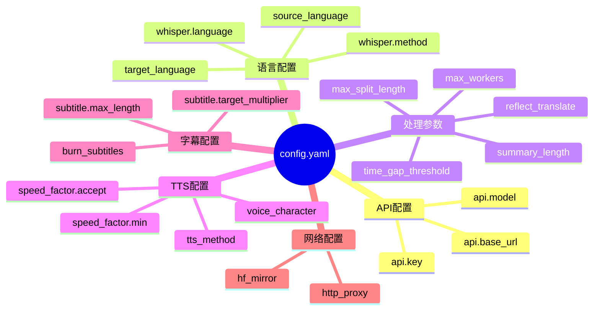

---

## 总结

VideoLingo 是一个模块化设计的视频本地化系统，具有以下特点：

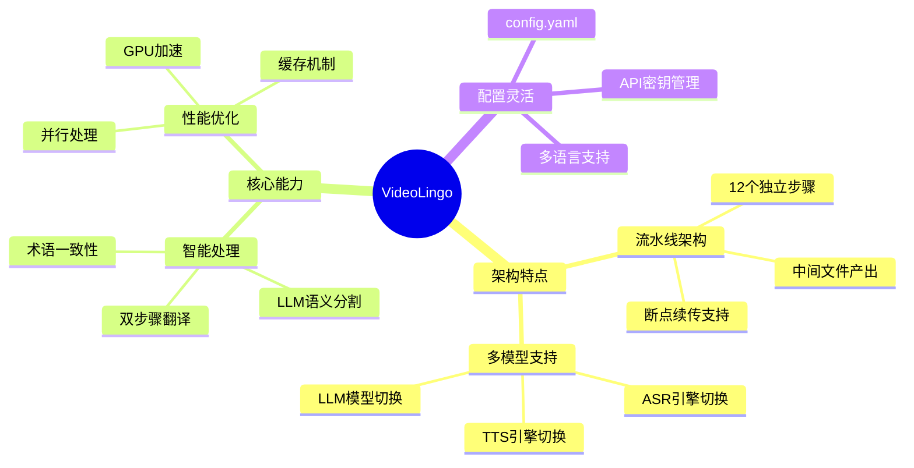

### 技术栈总览

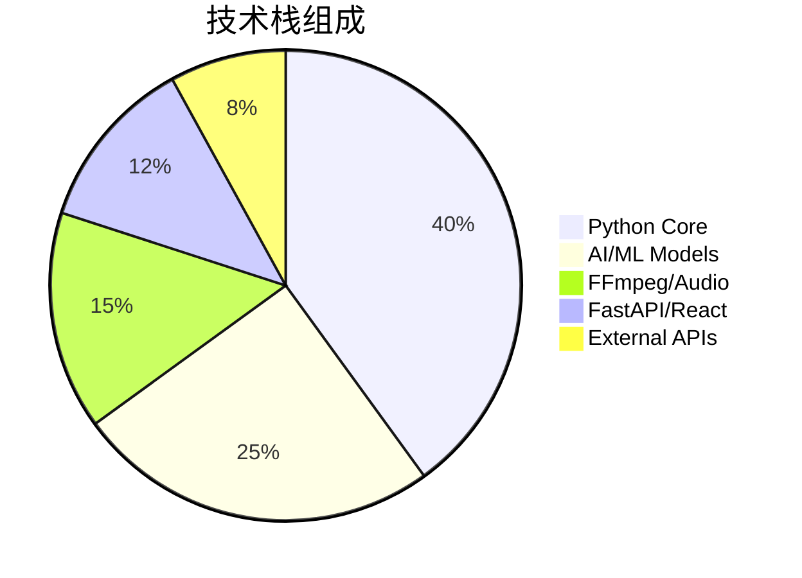
