# VideoLingo Core 架构文档

## 📋 目录

1. [项目概述](#项目概述)
2. [系统架构图](#系统架构图)
3. [处理流程详解](#处理流程详解)
4. [UML 图](#uml-图)
5. [模型与技术选型](#模型与技术选型)
6. [数据流图](#数据流图)

---

## 项目概述

VideoLingo 是一个完整的视频本地化处理系统，支持视频下载、语音识别（ASR）、字幕分割、翻译、配音（TTS）、音视频合成等全流程自动化处理。

### 核心功能模块

| 模块编号 | 文件名 | 功能描述 |
|---------|--------|---------|
| Step 1  | `_1_ytdlp.py` | 视频下载（yt-dlp） |
| Step 2  | `_2_asr.py` | 语音识别转录 |
| Step 3.1| `_3_1_split_nlp.py` | NLP句子分割 |
| Step 3.2| `_3_2_split_meaning.py` | 语义分割 |
| Step 4.1| `_4_1_summarize.py` | 内容摘要与术语提取 |
| Step 4.2| `_4_2_translate.py` | 翻译处理 |
| Step 5  | `_5_split_sub.py` | 字幕分割对齐 |
| Step 6  | `_6_gen_sub.py` | 字幕文件生成 |
| Step 7  | `_7_sub_into_vid.py` | 字幕烧录到视频 |
| Step 8.1| `_8_1_audio_task.py` | 配音任务生成 |
| Step 8.2| `_8_2_dub_chunks.py` | 配音分块处理 |
| Step 9  | `_9_refer_audio.py` | 参考音频提取 |
| Step 10 | `_10_gen_audio.py` | TTS 音频生成 |
| Step 11 | `_11_merge_audio.py` | 音频合并 |
| Step 12 | `_12_dub_to_vid.py` | 配音合成到视频 |

---

## 系统架构图

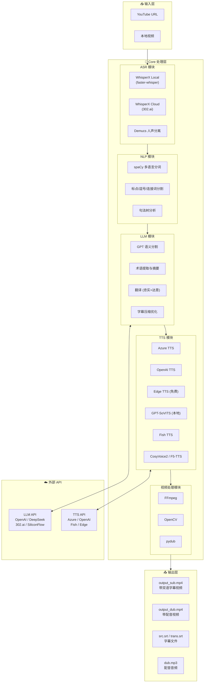

---

## 处理流程详解

### 完整处理流程图

```mermaid
flowchart LR
    subgraph Stage1["阶段一: 预处理"]
        S1["Step 1<br/>视频下载"]
        S2["Step 2<br/>语音识别"]
    end
    
    subgraph Stage2["阶段二: 文本处理"]
        S3_1["Step 3.1<br/>NLP分割"]
        S3_2["Step 3.2<br/>语义分割"]
        S4_1["Step 4.1<br/>摘要提取"]
        S4_2["Step 4.2<br/>翻译"]
    end
    
    subgraph Stage3["阶段三: 字幕处理"]
        S5["Step 5<br/>字幕分割"]
        S6["Step 6<br/>生成字幕"]
        S7["Step 7<br/>烧录字幕"]
    end
    
    subgraph Stage4["阶段四: 配音处理"]
        S8_1["Step 8.1<br/>配音任务"]
        S8_2["Step 8.2<br/>配音分块"]
        S9["Step 9<br/>参考音频"]
        S10["Step 10<br/>TTS生成"]
        S11["Step 11<br/>音频合并"]
        S12["Step 12<br/>配音合成"]
    end

    S1 --> S2 --> S3_1 --> S3_2 --> S4_1 --> S4_2
    S4_2 --> S5 --> S6 --> S7
    S7 --> S8_1 --> S8_2 --> S9 --> S10 --> S11 --> S12
```

### Step 2: 语音识别详细流程

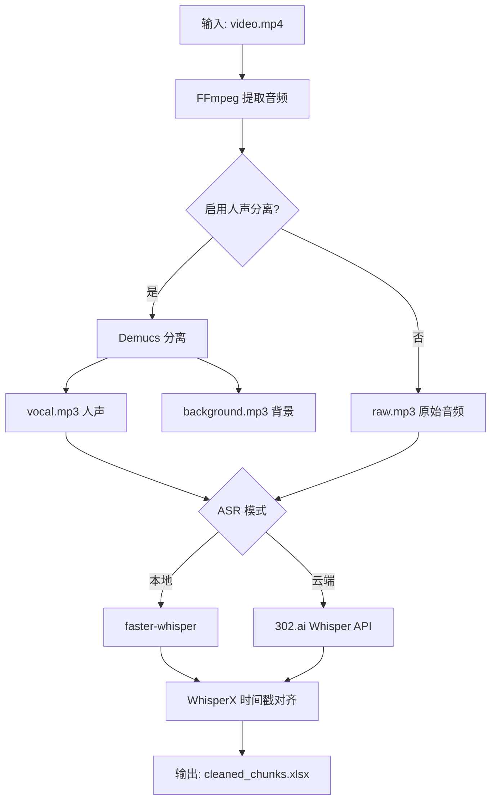

### Step 4.2: 翻译双步骤流程

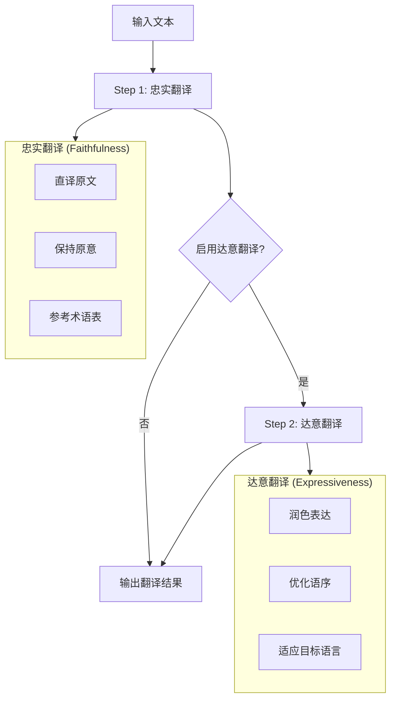

---

## UML 图

### 处理流程序列图

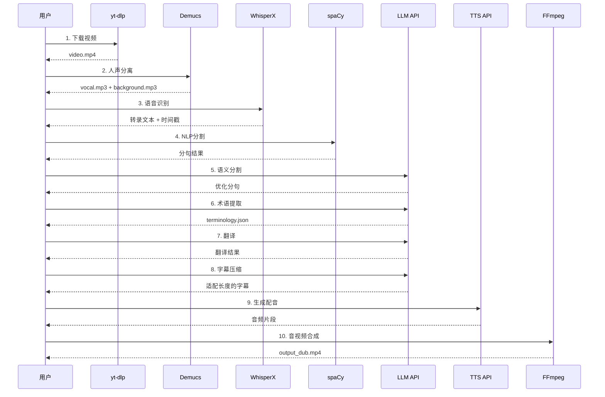

### 模块类图

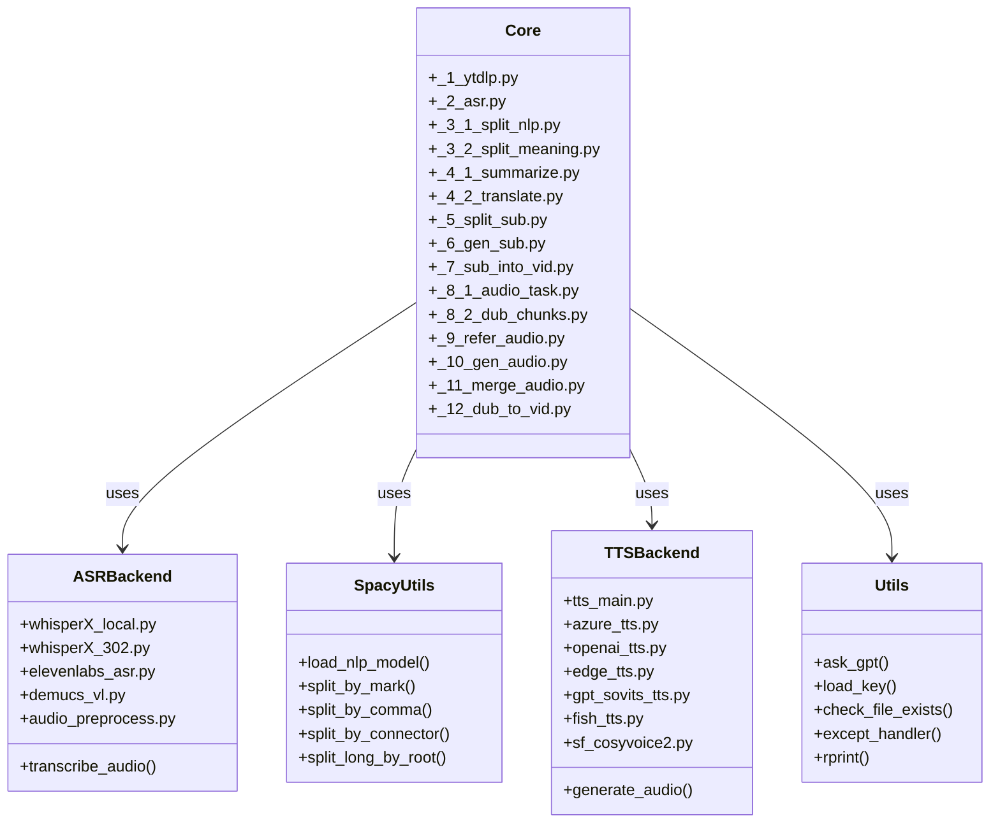

### 状态机图

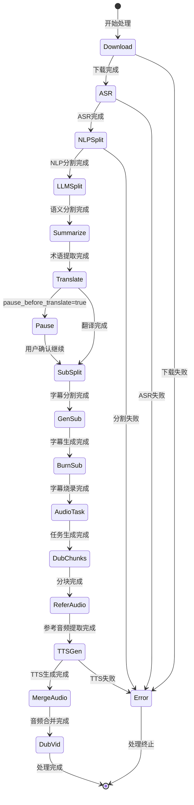

---

## 模型与技术选型

### ASR 模型对比

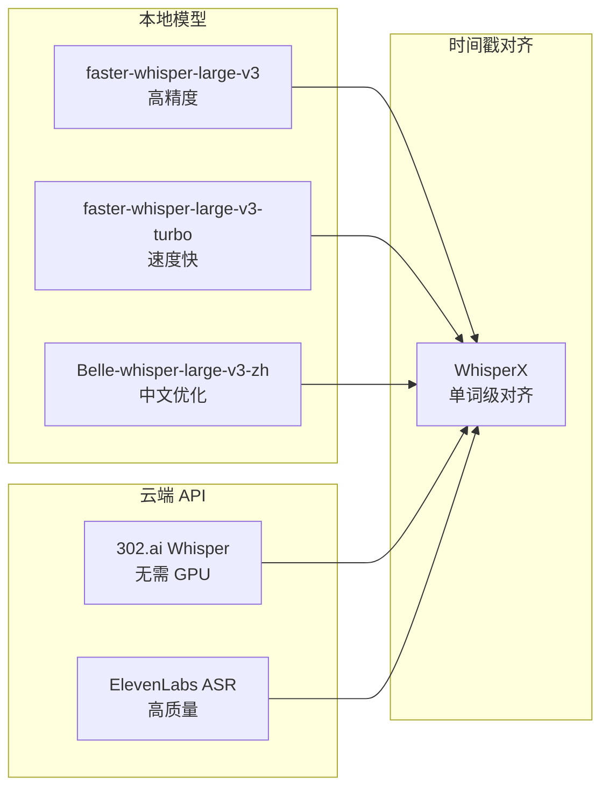

### TTS 功能支持表

| 引擎 | 语言支持 | 声音克隆 | 成本 | API 来源 |
|-----|---------|---------|------|---------|
| **Azure TTS** | 100+ | ❌ | 付费 | 302.ai |
| **OpenAI TTS** | 多语言 | ❌ | 付费 | 302.ai |
| **Edge TTS** | 多语言 | ❌ | 免费 | 微软 |
| **GPT-SoVITS** | 多语言 | ✅ | 本地部署 | 本地 |
| **Fish TTS** | 中/英 | ✅ | 付费 | 302.ai / SiliconFlow |
| **CosyVoice2** | 中/英 | ✅ | 付费 | SiliconFlow |
| **F5-TTS** | 多语言 | ✅ | 付费 | 302.ai |

### NLP 模型支持

| 语言 | spaCy 模型 | 用途 |
|-----|-----------|------|
| English | `en_core_web_md` | 分词、句法分析 |
| Chinese | `zh_core_web_md` | 中文分词 |
| Japanese | `ja_core_news_md` | 日文分词 |
| German | `de_core_news_md` | 德文分词 |
| French | `fr_core_news_md` | 法文分词 |
| Spanish | `es_core_news_md` | 西班牙文分词 |

---

## 数据流图

### 文件数据流

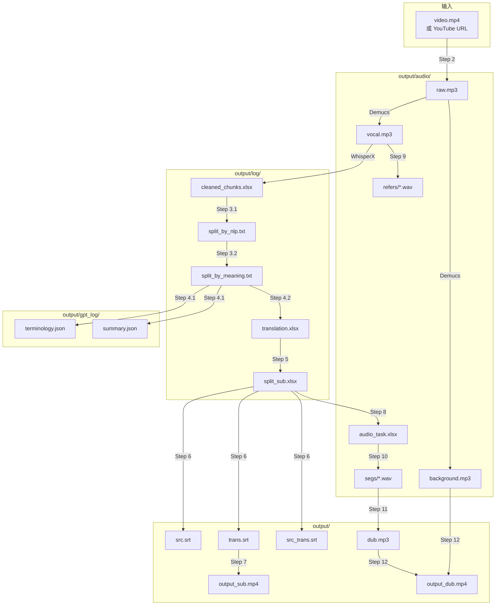

### 配置参数关系图

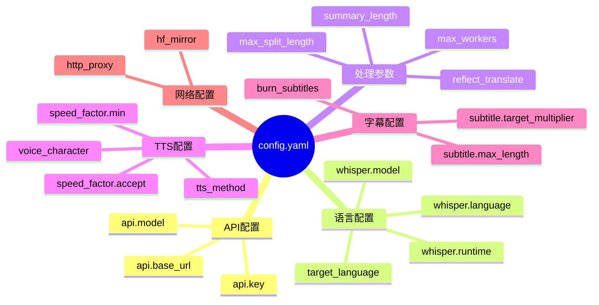

---

## 总结

VideoLingo 是一个模块化设计的视频本地化系统，具有以下特点：

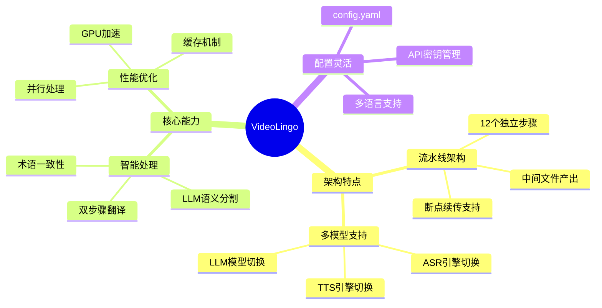

### 技术栈总览

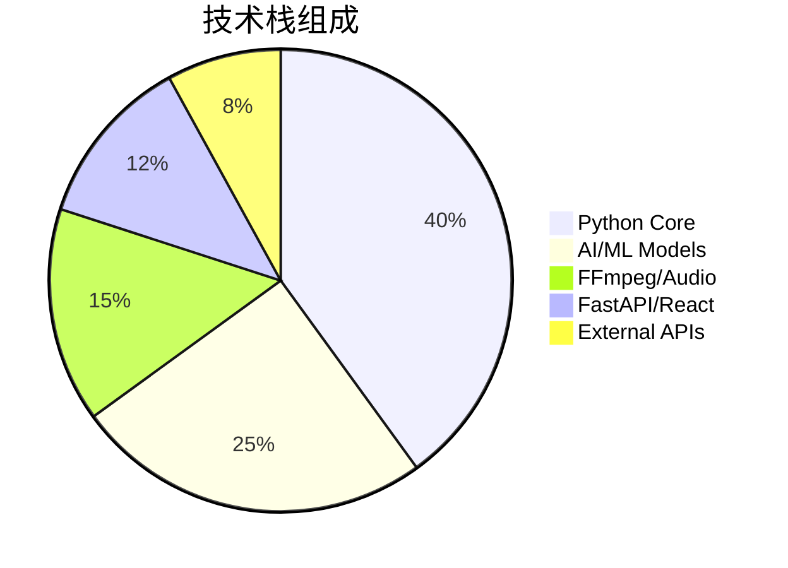
