# VideoLingo Core 架构文档

## 📋 目录

1. [项目概述](#项目概述)
2. [系统架构图](#系统架构图)
3. [处理流程详解](#处理流程详解)
4. [UML 图](#uml-图)
5. [模型与技术选型](#模型与技术选型)
6. [数据流图](#数据流图)

---

## 项目概述

VideoLingo 是一个完整的视频本地化处理系统，支持视频下载、语音识别（ASR）、字幕分割、翻译、配音（TTS）、音视频合成等全流程自动化处理。

### 核心功能模块

| 模块编号 | 文件名 | 功能描述 |
|---------|--------|---------|
| Step 1  | `_1_ytdlp.py` | 视频下载（yt-dlp） |
| Step 2  | `_2_asr.py` | 语音识别转录 |
| Step 3.1| `_3_1_split_nlp.py` | NLP句子分割 |
| Step 3.2| `_3_2_split_meaning.py` | 语义分割 |
| Step 4.1| `_4_1_summarize.py` | 内容摘要与术语提取 |
| Step 4.2| `_4_2_translate.py` | 翻译处理 |
| Step 5  | `_5_split_sub.py` | 字幕分割对齐 |
| Step 6  | `_6_gen_sub.py` | 字幕文件生成 |
| Step 7  | `_7_sub_into_vid.py` | 字幕烧录到视频 |
| Step 8.1| `_8_1_audio_task.py` | 配音任务生成 |
| Step 8.2| `_8_2_dub_chunks.py` | 配音分块处理 |
| Step 9  | `_9_refer_audio.py` | 参考音频提取 |
| Step 10 | `_10_gen_audio.py` | TTS 音频生成 |
| Step 11 | `_11_merge_audio.py` | 音频合并 |
| Step 12 | `_12_dub_to_vid.py` | 配音合成到视频 |

---

## 系统架构图

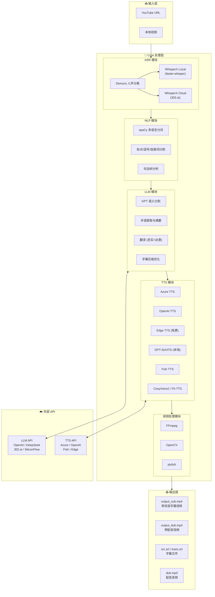

---

## 处理流程详解

### 完整处理流程图

```mermaid
flowchart LR
    subgraph Stage1["阶段一: 预处理"]
        S1["Step 1<br/>视频下载"]
        S2["Step 2<br/>语音识别"]
    end
    
    subgraph Stage2["阶段二: 文本处理"]
        S3_1["Step 3.1<br/>NLP分割"]
        S3_2["Step 3.2<br/>语义分割"]
        S4_1["Step 4.1<br/>摘要提取"]
        S4_2["Step 4.2<br/>翻译"]
    end
    
    subgraph Stage3["阶段三: 字幕处理"]
        S5["Step 5<br/>字幕分割"]
        S6["Step 6<br/>生成字幕"]
        S7["Step 7<br/>烧录字幕"]
    end
    
    subgraph Stage4["阶段四: 配音处理"]
        S8_1["Step 8.1<br/>配音任务"]
        S8_2["Step 8.2<br/>配音分块"]
        S9["Step 9<br/>参考音频"]
        S10["Step 10<br/>TTS生成"]
        S11["Step 11<br/>音频合并"]
        S12["Step 12<br/>配音合成"]
    end

    S1 --> S2 --> S3_1 --> S3_2 --> S4_1 --> S4_2
    S4_2 --> S5 --> S6 --> S7
    S7 --> S8_1 --> S8_2 --> S9 --> S10 --> S11 --> S12
```

### Step 2: 语音识别详细流程

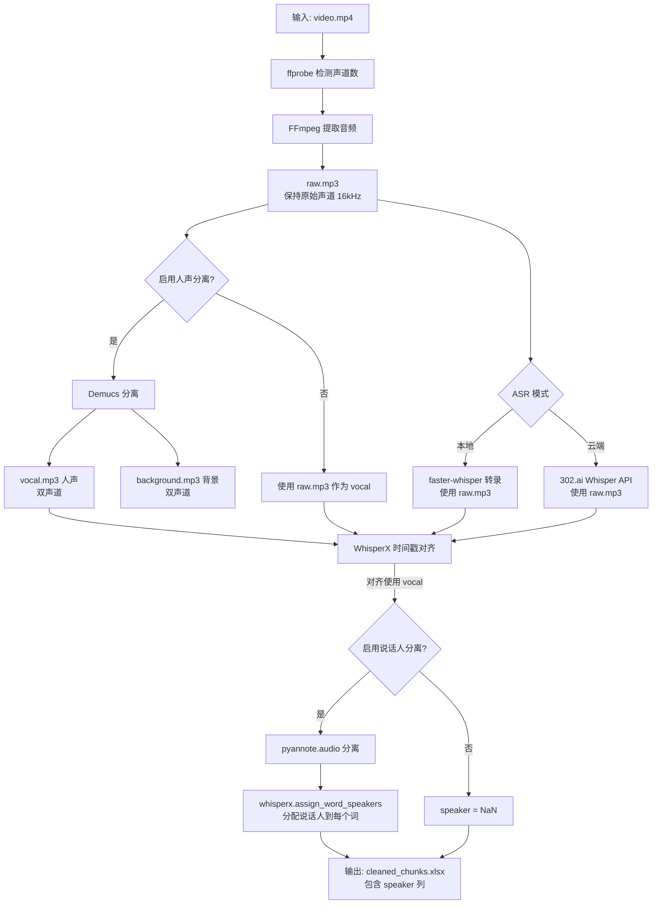

> **说明**: 
> - `raw.mp3` 保持与原始视频相同的声道数（动态检测），比特率 = 32k × 声道数
> - 转录阶段使用 `raw.mp3`，对齐阶段使用 `vocal.mp3`（如果启用了 Demucs）
> - Demucs 输出始终为双声道（模型特性）

### Step 2 补充：说话人分离（Speaker Diarization）

> **📌 说话人分离的作用**
>
> 当视频中有多个说话人时，说话人分离可以识别出"谁在什么时候说话"，
> 为后续的翻译和配音提供更精确的上下文信息。

#### 完整处理流程

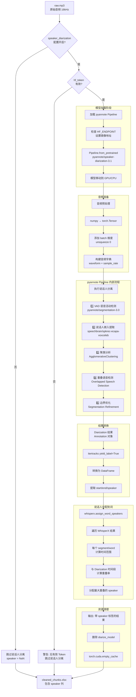

#### 说话人识别与声纹库（Qdrant）

> **📌 说明**
> - 说话人分离只给出匿名标签（如 `SPEAKER_00`）。
> - 说话人识别会将匿名标签映射到角色名。
> - 若 `speaker_samples/` 为空，可自动从分离结果中提取最长片段生成样本。

**流程要点：**
1. 使用 `pyannote/wespeaker-voxceleb-resnet34-LM` 提取声纹 embedding。
2. 参考样本写入 Qdrant（如果启用 `speaker_vector_db`）。
3. 识别时优先从 Qdrant 检索最相似声纹，再回写到 `segment/word.speaker`。

**Qdrant 存储结构：**
- **Collection**: `speaker_embeddings`（可配置）
- **Point ID**: UUID（由角色名派生）
- **Vector**: 声纹 embedding（flatten 后的浮点数组）
- **Payload**: `{ "speaker": "角色名" }`

#### pyannote-audio 4.0 Pipeline 详解

```mermaid
flowchart LR
    subgraph Input["输入"]
        A["音频文件/Tensor<br/>{'waveform': tensor, 'sample_rate': 16000}"]
    end
    
    subgraph Stage1["阶段 1: 语音检测"]
        B1["Segmentation Model<br/>pyannote/segmentation-3.0"]
        B2["输出: 语音/非语音时间段<br/>+ 重叠检测"]
    end
    
    subgraph Stage2["阶段 2: 嵌入提取"]
        C1["Embedding Model<br/>speechbrain/spkrec-ecapa-voxceleb"]
        C2["每个语音段 → 512维向量"]
    end
    
    subgraph Stage3["阶段 3: 聚类"]
        D1["层次聚类<br/>AgglomerativeClustering"]
        D2["相似度阈值判断<br/>合并同一说话人"]
    end
    
    subgraph Stage4["阶段 4: 后处理"]
        E1["边界优化"]
        E2["重叠区域处理"]
        E3["最小时长过滤"]
    end
    
    subgraph Output["输出"]
        F["Annotation 对象<br/>[(start, end, speaker_id), ...]"]
    end
    
    A --> B1 --> B2 --> C1 --> C2 --> D1 --> D2 --> E1 --> E2 --> E3 --> F
```

#### 说话人分离依赖的模型

| 模型名称 | HuggingFace 地址 | 用途 | 是否 Gated | 模型大小 |
|---------|-----------------|------|-----------|---------|
| speaker-diarization-3.1 | `pyannote/speaker-diarization-3.1` | 主 Pipeline 配置 | ✅ 需同意条款 | ~1KB (配置文件) |
| segmentation-3.0 | `pyannote/segmentation-3.0` | VAD + 重叠检测 | ✅ 需同意条款 | ~5MB |
| spkrec-ecapa-voxceleb | `speechbrain/spkrec-ecapa-voxceleb` | 说话人嵌入 (ECAPA-TDNN) | ❌ | ~80MB |

> **📌 注意**: pyannote-audio 4.0 默认使用 `speechbrain/spkrec-ecapa-voxceleb` 作为嵌入模型，
> 替代了之前版本的 `wespeaker-voxceleb-resnet34-LM`。

#### 代码实现细节

```python
# 1. 加载 Pipeline (whisperX_local.py)
from pyannote.audio import Pipeline
diarize_model = Pipeline.from_pretrained(
    "pyannote/speaker-diarization-3.1",
    token=hf_token  # HuggingFace Token
)
diarize_model = diarize_model.to(torch.device(device))  # GPU 加速

# 2. 准备音频输入
waveform = torch.from_numpy(raw_audio_segment).unsqueeze(0)
audio_dict = {"waveform": waveform, "sample_rate": 16000}

# 3. 执行说话人分离
diarize_result = diarize_model(audio_dict)

# 4. 转换结果为 DataFrame
diarize_df = pd.DataFrame(
    diarization.itertracks(yield_label=True), 
    columns=['segment', 'label', 'speaker']
)
diarize_df['start'] = diarize_df['segment'].apply(lambda x: x.start)
diarize_df['end'] = diarize_df['segment'].apply(lambda x: x.end)

# 5. 分配说话人到每个词
result = whisperx.assign_word_speakers(diarize_df, result)
```

#### 配置参数

| 参数 | 配置键 | 默认值 | 说明 |
|-----|-------|-------|------|
| 启用说话人分离 | `speaker_diarization` | `false` | 是否启用 pyannote 说话人分离 |
| HuggingFace Token | `hf_token` | 空 | 访问 gated 模型需要的 token |
| HuggingFace 镜像 | `hf_mirror` | 空 | 国内用户可设置为 `https://hf-mirror.com` |

#### 首次使用配置步骤

1. 访问 https://huggingface.co/settings/tokens 创建 Token（选择 "Read" 权限）
2. 访问以下页面并点击 "Agree" 同意条款：
   - https://huggingface.co/pyannote/speaker-diarization-3.1
   - https://huggingface.co/pyannote/segmentation-3.0
3. 在 `config.yaml` 中配置：
   ```yaml
   hf_token: 'hf_your_token_here'
   speaker_diarization: true
   hf_mirror: 'https://hf-mirror.com'  # 国内用户可选
   ```

#### 模型缓存位置

- Windows: `C:\Users\<用户名>\.cache\huggingface\hub\`
- Linux/Mac: `~/.cache/huggingface/hub/`

#### 依赖版本

| 包名 | 版本 | 说明 |
|-----|------|------|
| pyannote-audio | 4.0.3 | 主库 |
| pyannote-core | 6.0.1 | 核心数据结构 |
| pyannote-pipeline | 4.0.0 | Pipeline 框架 |
| speechbrain | - | 说话人嵌入模型 |
| whisperx | - | 时间戳分配 |

> **注意**：首次运行需要联网下载模型（约 85MB），后续运行直接从本地缓存加载。
> GPU 加速显著提升处理速度，建议使用 CUDA 设备。

### Step 3.1: 文本粗切分（NLP 预处理）

> **📌 注意：这一步不是真正的"分句"，而是文本粗切分**
> 
> Step 3.1 的目的是将 ASR 输出的长文本按**标点、时间间隔、连接词**等规则进行**粗切分**，
> 为后续的语义分割提供较短的文本片段。spaCy 在这里主要用于：
> - **分词（tokenize）**：计算文本长度
> - **依存分析**：识别连接词、词根等语法结构
> 
> **真正的智能分句在 Step 3.2 由 GPT 完成。**

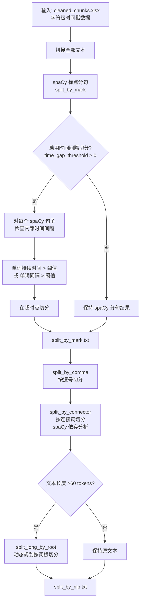

**时间间隔切分处理顺序**：

1. **先 spaCy 标点分句**：使用 spaCy 的 `doc.sents` 对全文进行标点分句
2. **后时间二次切分**：对每个 spaCy 分出的句子，检查内部是否有超阈值的时间间隔
   - 检查单词的 `duration`（持续时间）：Whisper 会把停顿时间算入单词持续时间
   - 检查单词间的 `gap_to_next`（间隔）：真正的单词间停顿
   - 如果任一值超过阈值，在该位置切分

> **为什么是这个顺序**：
> - 如果先时间切分再 spaCy 分句，spaCy 可能会对时间切分产生的片段做错误的二次分句
> - 例如日语 spaCy 可能把"かね何..."错误地切成"か"和"ね何..."
> - 先 spaCy 再时间切分，可以保留 spaCy 的标点识别能力，同时利用时间信息做精确切分

**spaCy 在 Step 3.1 的作用**：

| 功能 | 用途 | 说明 |
|-----|------|------|
| 分词 (tokenize) | 计算文本长度 | 判断是否需要进一步切分 |
| 依存分析 (dep) | 识别连接词 | `that`, `which`, `ので`, `ため` 等 |
| 词性标注 (pos) | 识别词根 | 动词、名词等作为切分点 |
| 句子边界 (sents) | 标点分句 | 对全文做初步标点分句 |

**时间间隔切分参数**：

| 参数 | 配置键 | 默认值 | 说明 |
|-----|-------|-------|------|
| 时间间隔阈值 | `time_gap_threshold` | 空 (不启用) | 单词持续时间或间隔超过此值(秒)时在 spaCy 句子内部再切分 |

> **日语处理优化**：日语口语通常没有明显标点，但 Whisper ASR 会在自然停顿处产生较长的单词持续时间。
> 设置 `time_gap_threshold: 3` 可以利用这些停顿点进行切分。
> 
> **注意**：Whisper 通常把停顿时间算入前一个单词的 `duration`，而不是 `gap_to_next`。
> 因此代码同时检查这两个值，确保不遗漏任何停顿点。

**文件流**：

```
cleaned_chunks.xlsx     ← ASR 输出（字符级时间戳）
    ↓ split_by_mark()       
    │   1. 拼接全文
    │   2. spaCy 标点分句
    │   3. (可选) 按时间间隔二次切分
split_by_mark.txt (临时)
    ↓ split_by_comma_main() 按逗号切分
split_by_comma.txt (临时)
    ↓ split_sentences_main() 按连接词切分
split_by_connector.txt (临时)
    ↓ split_long_by_root_main() 按词根切分超长文本
split_by_nlp.txt        ← Step 3.1 最终输出（粗切分结果）
```

### Step 3.2: 语义分句（GPT 智能分割）

> **📌 这一步才是真正的"分句"**
> 
> Step 3.2 使用 **GPT 进行语义理解**，将粗切分的文本片段进一步分割成**语义完整的句子**。
> spaCy 在这里只用于 **分词（tokenize）** 来计算文本长度，判断是否需要调用 GPT。

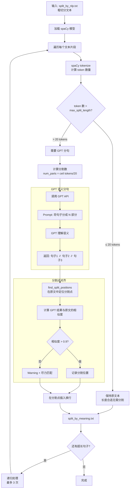

**spaCy 在 Step 3.2 的作用**：

| 功能 | 用途 |
|-----|------|
| **分词 (tokenize)** | 计算文本的 token 数量，判断是否超过阈值需要 GPT 分句 |

> **注意**：Step 3.2 中 spaCy **不做分句**，分句完全由 GPT 完成。

**语义分句关键参数**:

| 参数 | 配置键 | 默认值 | 说明 |
|-----|-------|-------|------|
| 最大分割长度 | `max_split_length` | 20 | 超过此 token 数触发 GPT 分句 |
| 时间间隔阈值 | `time_gap_threshold` | 空 (不启用) | Step 3.1 中按时间切分的阈值(秒) |
| 并发数 | `max_workers` | 4 | GPT 请求并发数 |
| 相似度阈值 | - | 0.9 | 分割点定位的最小相似度 |
| 最大重试次数 | - | 3 | 递归处理超长句子的次数 |

**语言模型选择逻辑**:

```python
# init_nlp() 语言选择 - 用于分词
user_language = load_key("whisper.language")      # 用户设置的语言
detected_language = load_key("whisper.detected_language")  # 自动检测的语言
language = user_language if user_language else detected_language

# 映射到 spaCy 模型（用于分词，不是分句）
SPACY_MODEL_MAP = {
    "ja": "ja_core_news_md",
    "en": "en_core_web_md", 
    "zh": "zh_core_web_md",
    ...
}
```

**GPT 分割 Prompt 示例**:

```
请将以下句子分成 3 部分，用 || 分隔:
"高レベルの警戒隠蔽を使うことはヨガラスのカメラを通して見ていたのでなお前が王女につきまとっていると知りサラムの魔眼に似せた仕組みを作らせたのだ"

GPT 返回:
"高レベルの警戒隠蔽を使うことはヨガラスのカメラを通して見ていたので||なお前が王女につきまとっていると知り||サラムの魔眼に似せた仕組みを作らせたのだ"
```

### Step 4.2: 翻译双步骤流程

> **⚠️ CJK 模式的分句"破坏"与重建**
>
> 对于 CJK 语言（日语 ja、中文 zh、韩语 ko），Step 4.2 会**打破 Step 3.2 的分句结构**：
> - Step 3.2 精心分割的语义句子在 Step 4.2 被**合并成大块**发送给 LLM 翻译
> - 翻译结果按 LLM 自然换行分割，**不再与原文行数对应**
> - 原文字符被**按字符数均匀分配**到翻译行中（用于显示对照，非语义对应）
> - 时间戳也被**均匀分配**到新的翻译行上
>
> **目的**：CJK 语言的特点是没有空格分词，Step 3.2 的分句结果可能在翻译后产生不自然的断句。
> 让 LLM 在翻译时自主决定如何断句，可以获得更流畅的目标语言字幕。
>
> **后果**：原文与译文的**行级对应关系被破坏**，但 Step 5 会再次基于字幕长度限制进行分割对齐。

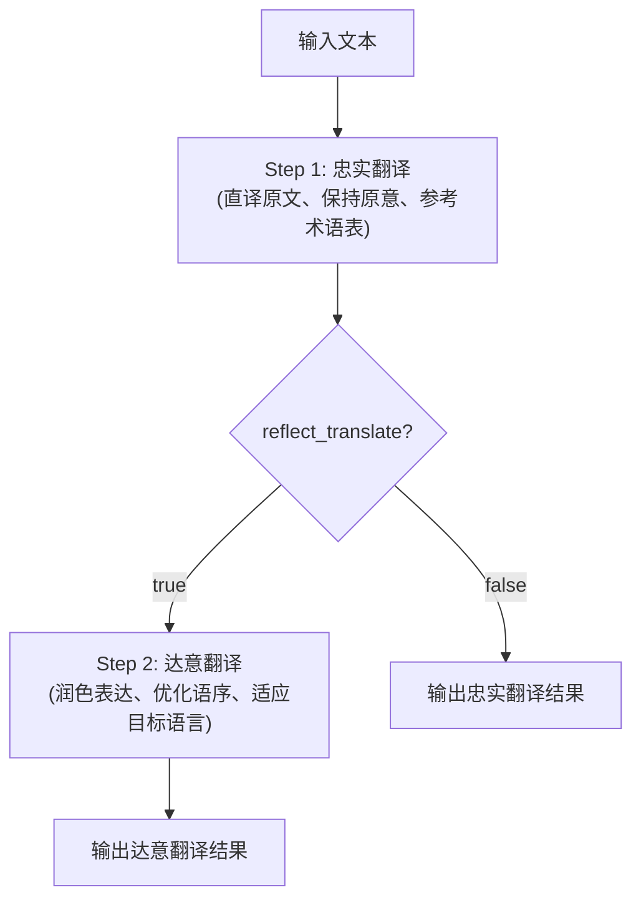

#### CJK 模式技术实现

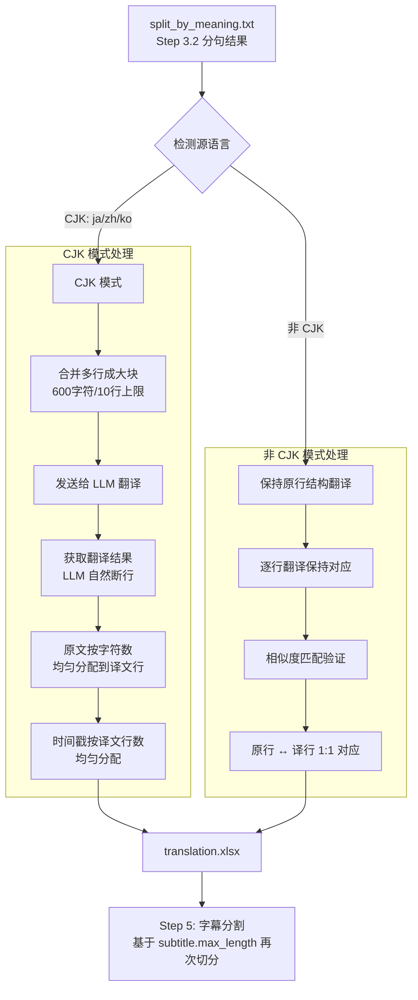

**CJK 模式关键代码逻辑**:

```python
# 检测是否为 CJK 语言
cjk_languages = ['ja', 'zh', 'ko', 'japanese', 'chinese', 'korean']
is_cjk = detected_language.lower() in cjk_languages

if is_cjk:
    # 原文字符均匀分配到译文行
    chars_per_line = len(src_block) // len(trans_lines)
    src_text.append(src_block[start_idx:end_idx])
    
    # 时间戳均匀分配
    duration_per_line = total_duration / num_lines
```

### Step 5: 字幕分割对齐（重建分句结构）

> **📌 Step 5 的核心作用**
>
> Step 5 基于**显示长度限制**重新切分字幕，确保每行字幕不超过 `subtitle.max_length` 字符。
> 这一步对于 CJK 模式尤其重要，因为 Step 4.2 已经破坏了原有的分句结构。

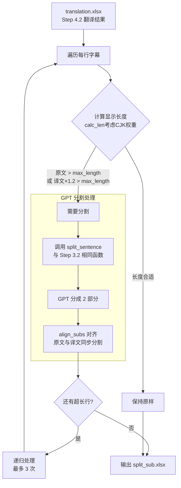

**字幕长度计算权重**：

```python
def calc_len(text: str) -> float:
    """计算字幕显示长度，考虑不同字符宽度"""
    # 中日文字符权重 1.75
    # 韩文字符权重 1.5
    # 泰文字符权重 1.0
    # 全角符号权重 1.75
    # 英文和半角符号权重 1.0
```

**Step 5 关键参数**：

| 参数 | 配置键 | 默认值 | 说明 |
|-----|-------|-------|------|
| 字幕最大长度 | `subtitle.max_length` | 75 | 每行字幕的最大字符数（考虑权重后） |
| 译文长度倍数 | `subtitle.target_multiplier` | 1.2 | 译文通常比原文长，乘以此倍数后判断是否超长 |

### Step 3-4-5 分句流程总览

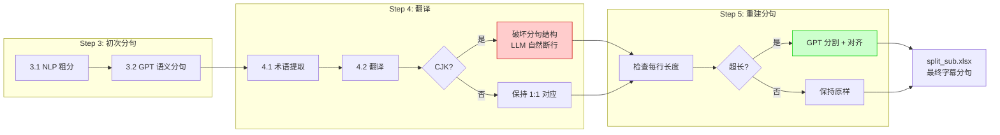

> **设计意图总结**：
> - **Step 3.2**: 基于语义的"粗分"，为翻译提供合理的上下文单元
> - **Step 4.2 CJK 模式**: 打破分句，让 LLM 翻译时自然断行，获得流畅的目标语言
> - **Step 5**: 基于显示长度的"精分"，确保字幕可读性，使用同样的 GPT 分句函数重建结构

---

## UML 图

### 处理流程序列图

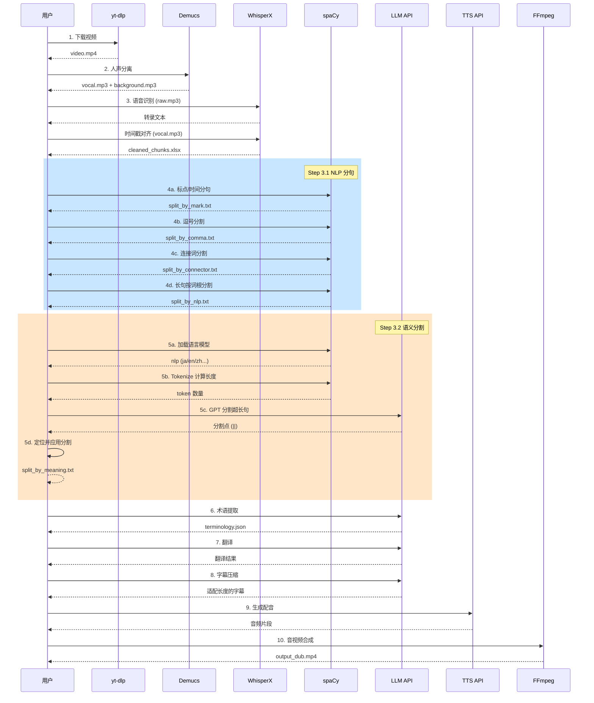

### 模块类图

```mermaid
classDiagram
    class Core {
        +_1_ytdlp.py
        +_2_asr.py
        +_3_1_split_nlp.py
        +_3_2_split_meaning.py
        +_4_1_summarize.py
        +_4_2_translate.py
        +_5_split_sub.py
        +_6_gen_sub.py
        +_7_sub_into_vid.py
        +_8_1_audio_task.py
        +_8_2_dub_chunks.py
        +_9_refer_audio.py
        +_10_gen_audio.py
        +_11_merge_audio.py
        +_12_dub_to_vid.py
    }
    
    class ASRBackend {
        +whisperX_local.py
        +whisperX_302.py
        +elevenlabs_asr.py
        +demucs_vl.py
        +audio_preprocess.py
        +transcribe_audio()
        +speaker_diarization()
    }
    
    class SpeakerDiarization {
        +pyannote.audio 4.0.3 Pipeline
        +speaker-diarization-3.1
        +segmentation-3.0
        +speechbrain/spkrec-ecapa-voxceleb
        +AgglomerativeClustering
        +whisperx.assign_word_speakers()
    }
    
    class SpacyUtils {
        +load_nlp_model()
        +split_by_mark()
        +split_by_comma()
        +split_by_connector()
        +split_long_by_root()
    }
    
    class TTSBackend {
        +tts_main.py
        +azure_tts.py
        +openai_tts.py
        +edge_tts.py
        +gpt_sovits_tts.py
        +fish_tts.py
        +sf_cosyvoice2.py
        +generate_audio()
    }
    
    class Utils {
        +ask_gpt()
        +load_key()
        +check_file_exists()
        +except_handler()
        +rprint()
    }
    
    Core --> ASRBackend : uses
    ASRBackend --> SpeakerDiarization : optional
    Core --> SpacyUtils : uses
    Core --> TTSBackend : uses
    Core --> Utils : uses
```

### 状态机图

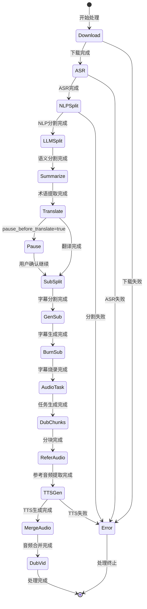

---

## 模型与技术选型

### ASR 模型对比

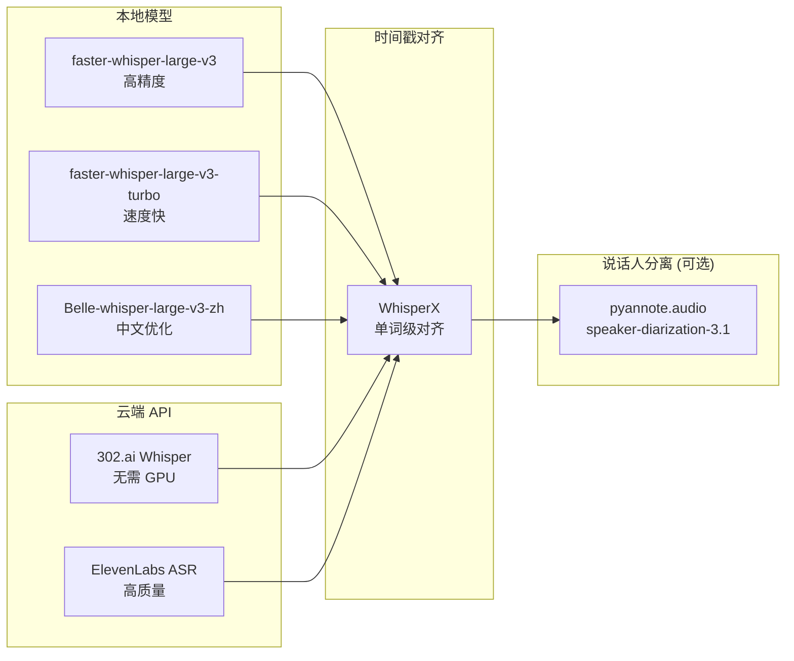

### 说话人分离技术栈 (pyannote-audio 4.0.3)

| 组件 | 模型/库 | HuggingFace 地址 | 说明 |
|-----|--------|------------------|------|
| Pipeline | pyannote-audio 4.0.3 | `pyannote/speaker-diarization-3.1` | 主 Pipeline 配置文件 |
| VAD + OSD | segmentation-3.0 | `pyannote/segmentation-3.0` | 语音活动检测 + 重叠语音检测 |
| Speaker Embedding | ECAPA-TDNN | `speechbrain/spkrec-ecapa-voxceleb` | 提取说话人 512 维特征向量 |
| Clustering | AgglomerativeClustering | - | 层次聚类，合并同一说话人 |
| Speaker Assignment | whisperx | `whisperx.assign_word_speakers` | 将说话人标签分配到每个词 |

> **版本变更说明**: pyannote-audio 4.0 使用 `speechbrain/spkrec-ecapa-voxceleb` (ECAPA-TDNN) 替代了
> 之前版本的 `wespeaker-voxceleb-resnet34-LM`，提供更好的说话人嵌入质量。

### TTS 功能支持表

| 引擎 | 语言支持 | 声音克隆 | 成本 | API 来源 |
|-----|---------|---------|------|---------|
| **Azure TTS** | 100+ | ❌ | 付费 | 302.ai |
| **OpenAI TTS** | 多语言 | ❌ | 付费 | 302.ai |
| **Edge TTS** | 多语言 | ❌ | 免费 | 微软 |
| **GPT-SoVITS** | 多语言 | ✅ | 本地部署 | 本地 |
| **Fish TTS** | 中/英 | ✅ | 付费 | 302.ai / SiliconFlow |
| **CosyVoice2** | 中/英 | ✅ | 付费 | SiliconFlow |
| **F5-TTS** | 多语言 | ✅ | 付费 | 302.ai |

### NLP 模型支持

| 语言 | spaCy 模型 | 用途 |
|-----|-----------|------|
| English | `en_core_web_md` | 分词、句法分析 |
| Chinese | `zh_core_web_md` | 中文分词 |
| Japanese | `ja_core_news_md` | 日文分词 |
| German | `de_core_news_md` | 德文分词 |
| French | `fr_core_news_md` | 法文分词 |
| Spanish | `es_core_news_md` | 西班牙文分词 |

---

## 数据流图

### 文件数据流

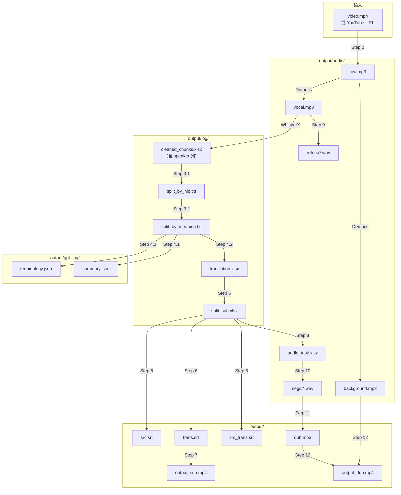

### 配置参数关系图

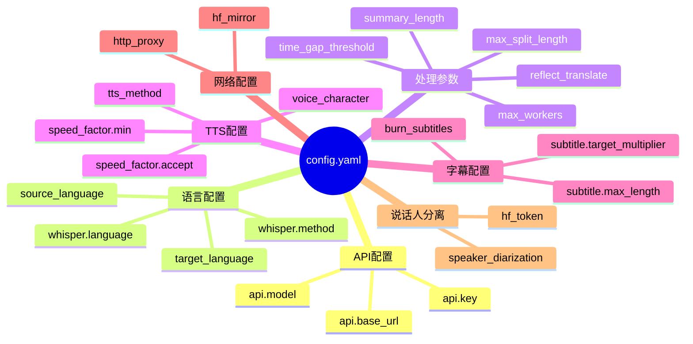

---

## 总结

VideoLingo 是一个模块化设计的视频本地化系统，具有以下特点：

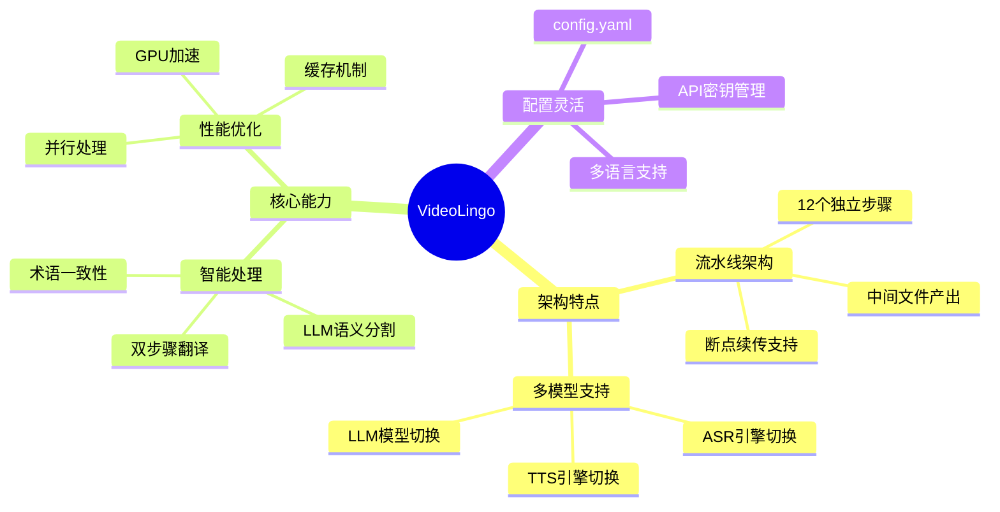

### 技术栈总览

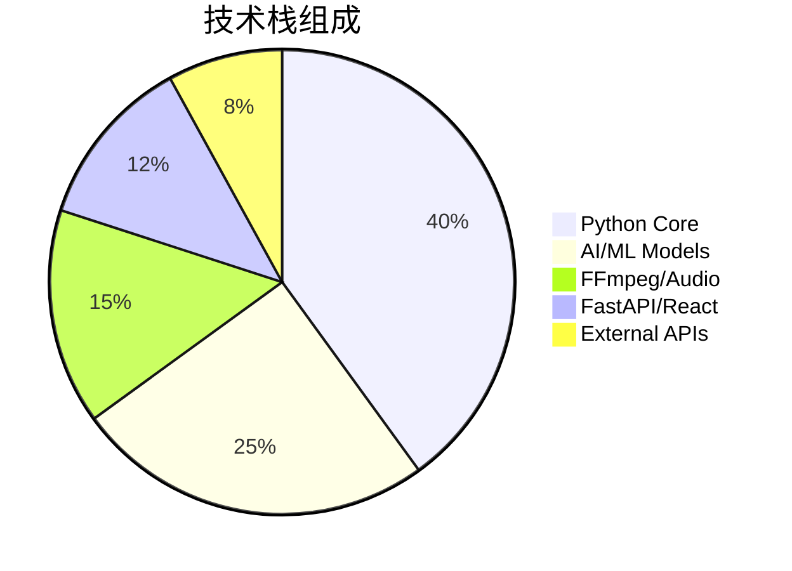
