# 字幕校对编辑器 技术架构文档

## 目录

1. [功能概述](#功能概述)
2. [系统架构](#系统架构)
3. [前端组件架构](#前端组件架构)
4. [状态管理](#状态管理)
5. [数据持久化](#数据持久化)
6. [核心交互设计](#核心交互设计)
7. [后端服务](#后端服务)
8. [API 接口](#api-接口)
9. [时序图](#时序图)
10. [技术细节](#技术细节)

---

## 功能概述

字幕校对编辑器（SubtitleEditor）是 VideoLingo 的专业字幕编辑模块，提供 **Aegisub 风格**的字幕编辑体验。用户可以在视频处理流水线完成后，对生成的双语字幕进行校对、时间轴调整，并最终将字幕烧录到视频中。

### 核心能力

| 能力 | 说明 |
|------|------|
| 双语字幕编辑 | 同时编辑原文和译文，实时预览效果 |
| 波形时间轴 | 基于 WaveSurfer.js 的音频波形可视化，拖拽调整时间轴 |
| 视频字幕叠加 | 视频播放器实时渲染字幕叠加预览 |
| 草稿自动保存 | IndexedDB 本地存储，30 秒自动保存 |
| 字幕还原 | 一键还原到原始生成的字幕 |
| 多种合并模式 | 支持 5 种字幕格式烧录到视频 |
| 字幕样式配置 | 字体大小、颜色、布局可自定义 |

---

## 系统架构

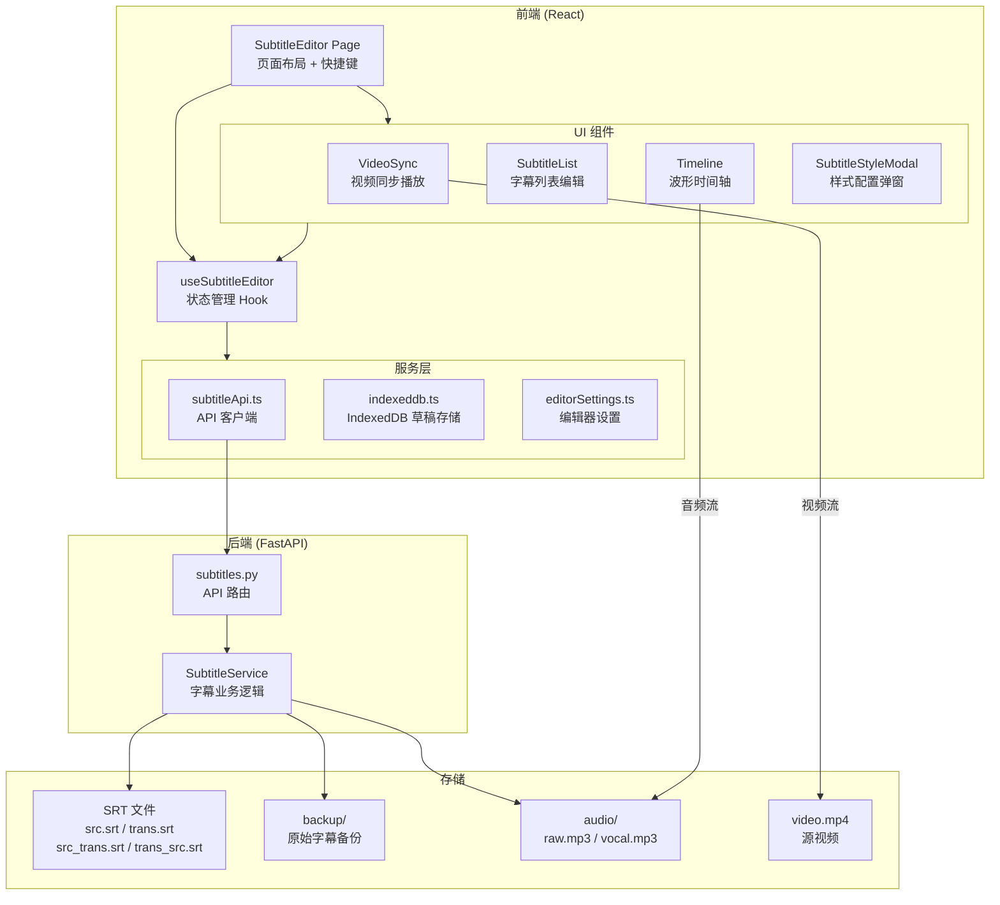

---

## 前端组件架构

### 页面布局

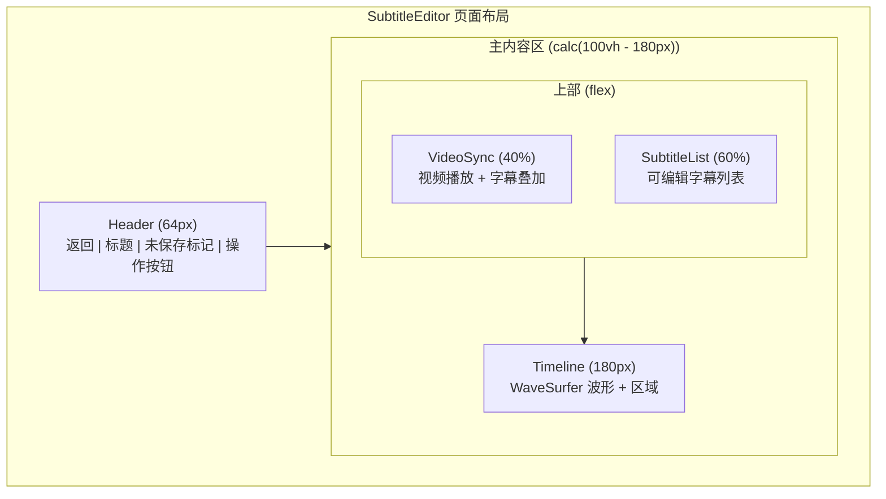

### 组件职责

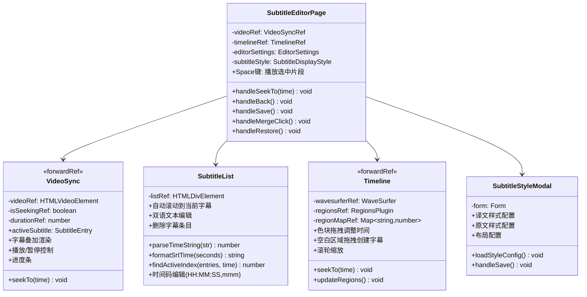

### 组件通信

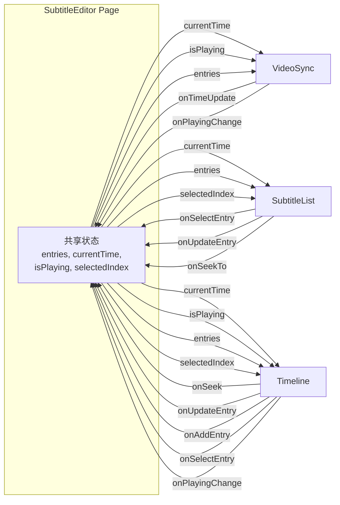

---

## 状态管理

### useSubtitleEditor Hook

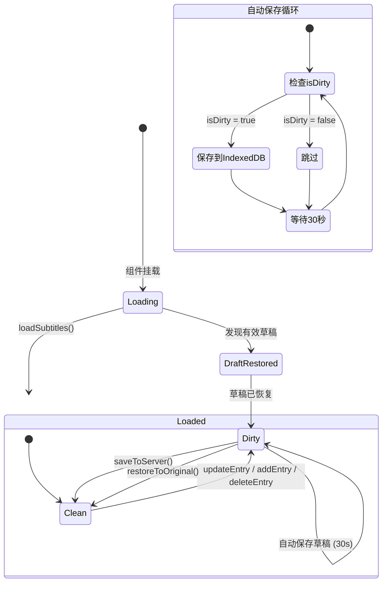

### 状态字段

| 字段 | 类型 | 说明 |
|------|------|------|
| `entries` | `SubtitleEntry[]` | 字幕条目列表 |
| `currentTime` | `number` | 当前播放时间（秒） |
| `isPlaying` | `boolean` | 是否正在播放 |
| `selectedIndex` | `number \| null` | 当前选中的字幕索引 |
| `isDirty` | `boolean` | 是否有未保存的更改 |
| `isLoading` | `boolean` | 是否正在加载 |
| `isSaving` | `boolean` | 是否正在保存到服务器 |
| `isMerging` | `boolean` | 是否正在合并到视频 |
| `isRestoring` | `boolean` | 是否正在还原 |
| `hasBackup` | `boolean` | 是否存在备份 |

### SubtitleEntry 数据结构

```typescript
interface SubtitleEntry {
  index: number;        // 字幕序号
  startTime: number;    // 开始时间（秒）
  endTime: number;      // 结束时间（秒）
  text: string;         // 译文
  originalText?: string; // 原文
}
```

---

## 数据持久化

### 三层存储架构

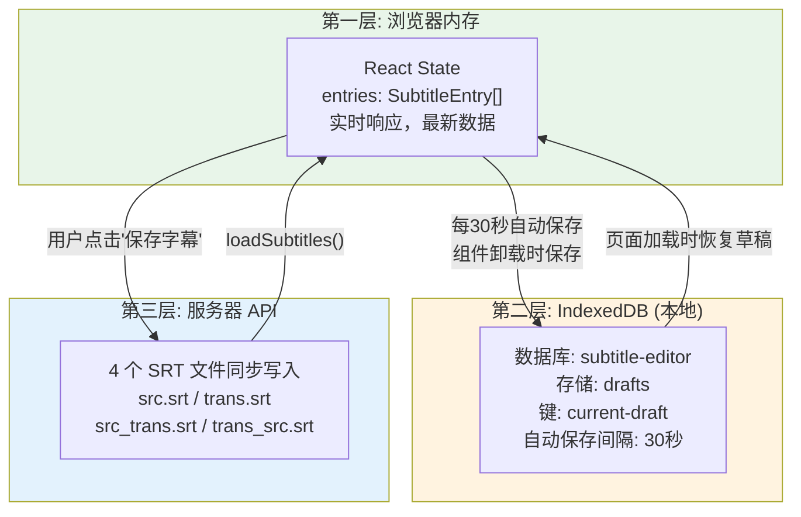

### IndexedDB 存储结构

```typescript
// 数据库配置
const DB_NAME = 'subtitle-editor';
const DB_VERSION = 1;
const STORE_NAME = 'drafts';
const DRAFT_KEY = 'current-draft';

// 存储格式
interface DraftRecord {
  id: string;                    // 固定为 'current-draft'
  entries: SubtitleEntry[];      // 字幕数据
  updatedAt: string;             // ISO 时间戳
}
```

### 草稿恢复策略

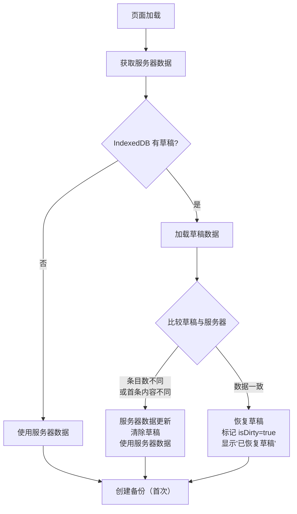

---

## 核心交互设计

### Aegisub 风格快捷键播放

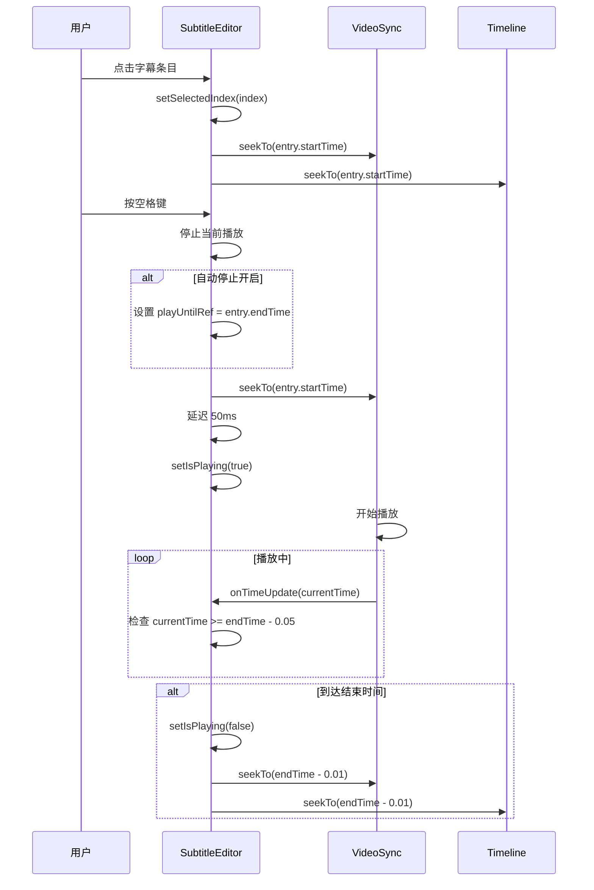

### 三方同步机制

视频播放器、波形时间轴、字幕列表三个组件通过共享状态实现同步：

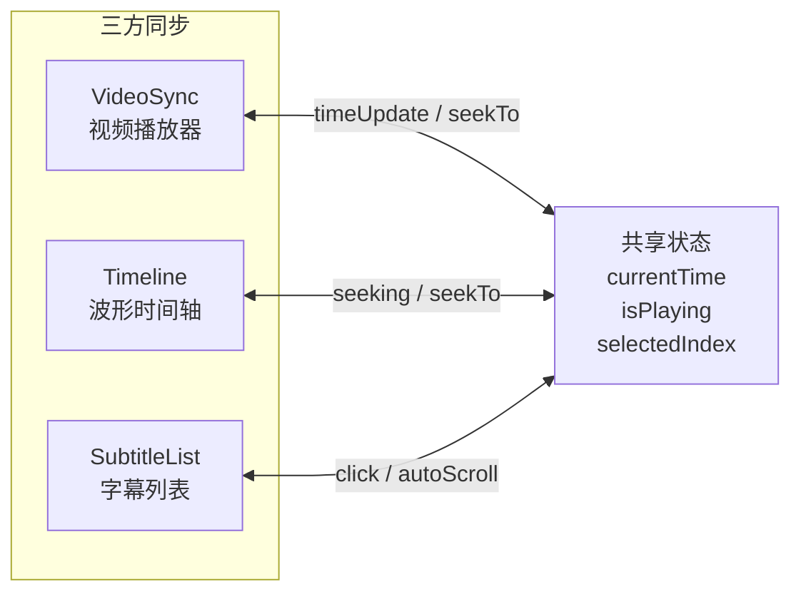

| 操作 | 触发源 | 同步目标 |
|------|--------|---------|
| 点击字幕条目 | SubtitleList | Video seekTo + Timeline seekTo |
| 拖拽波形游标 | Timeline | Video seekTo + List autoScroll |
| 视频播放 timeUpdate | VideoSync | Timeline position + List autoScroll |
| 空格键播放 | Page keydown | Video play + Timeline play |
| 拖拽区域边缘 | Timeline | entries 更新 → 三方刷新 |

### WaveSurfer 波形时间轴

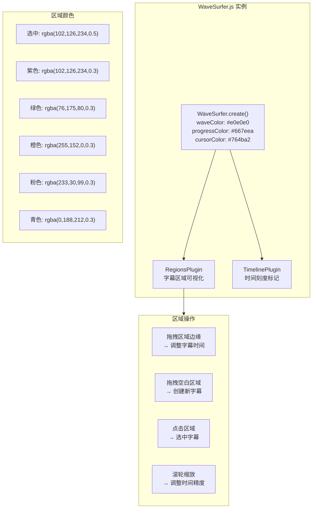

---

## 后端服务

### SubtitleService 类图

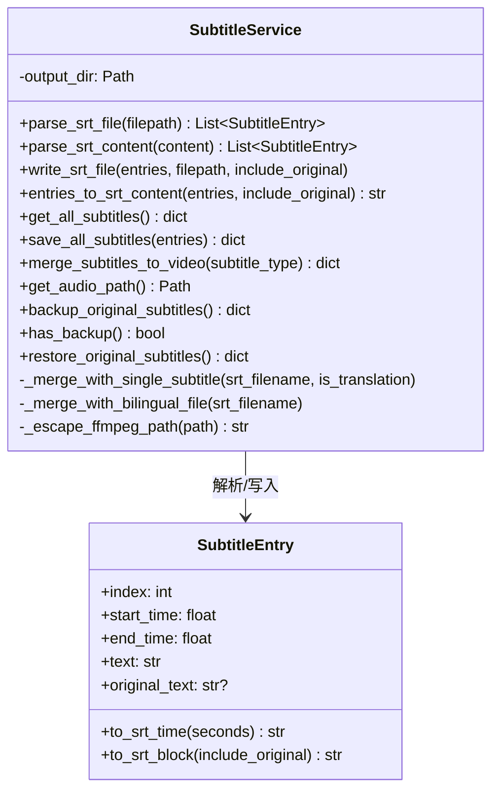

### 四文件同步写入

保存字幕时，`save_all_subtitles()` 同步更新 4 个 SRT 文件：

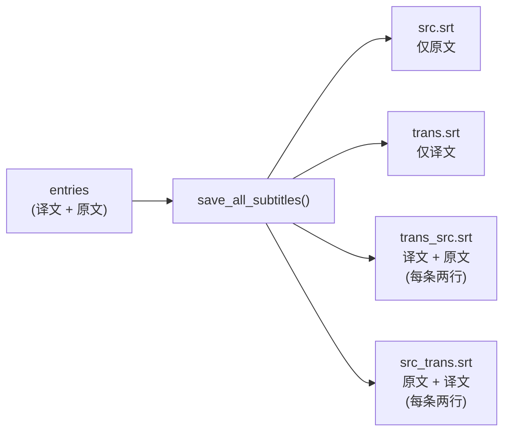

### 合并到视频

支持 5 种字幕格式烧录：

| 模式 | 参数值 | 说明 | FFmpeg 处理方式 |
|------|--------|------|----------------|
| 双语分层 | `dual` | 默认，原文和译文分别渲染 | 调用 core `merge_subtitles_to_video()` |
| 译文在上 | `trans_src` | 单文件双语，译文上原文下 | 使用 trans_src.srt 单文件 |
| 原文在上 | `src_trans` | 单文件双语，原文上译文下 | 使用 src_trans.srt 单文件 |
| 仅译文 | `trans_only` | 只显示译文 | 使用 trans.srt 单文件 |
| 仅原文 | `src_only` | 只显示原文 | 使用 src.srt 单文件 |

### 备份与还原

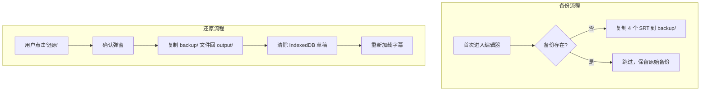

---

## API 接口

### 接口总览

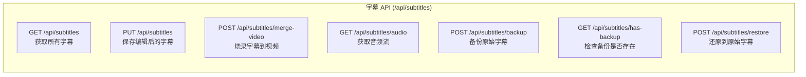

### 接口详情

| 方法 | 路径 | 请求体 | 响应 | 说明 |
|------|------|--------|------|------|
| GET | `/api/subtitles` | - | `{ entries, files, totalCount }` | 获取字幕（优先读取 trans_src.srt） |
| PUT | `/api/subtitles` | `{ entries: SubtitleEntry[] }` | `{ success, savedFiles, entryCount }` | 同步保存到 4 个 SRT 文件 |
| POST | `/api/subtitles/merge-video` | `{ subtitleType }` | `{ success, outputVideo, exists }` | FFmpeg 烧录字幕到视频 |
| GET | `/api/subtitles/audio` | - | `audio/mpeg` (FileResponse) | 获取音频文件（raw.mp3 或 vocal.mp3） |
| POST | `/api/subtitles/backup` | - | `{ success, backedUp, skipped }` | 备份 SRT 文件到 backup/ 目录 |
| GET | `/api/subtitles/has-backup` | - | `{ hasBackup }` | 检查是否已有备份 |
| POST | `/api/subtitles/restore` | - | `{ success, restored, message }` | 从 backup/ 还原 SRT 文件 |

### 字幕读取优先级

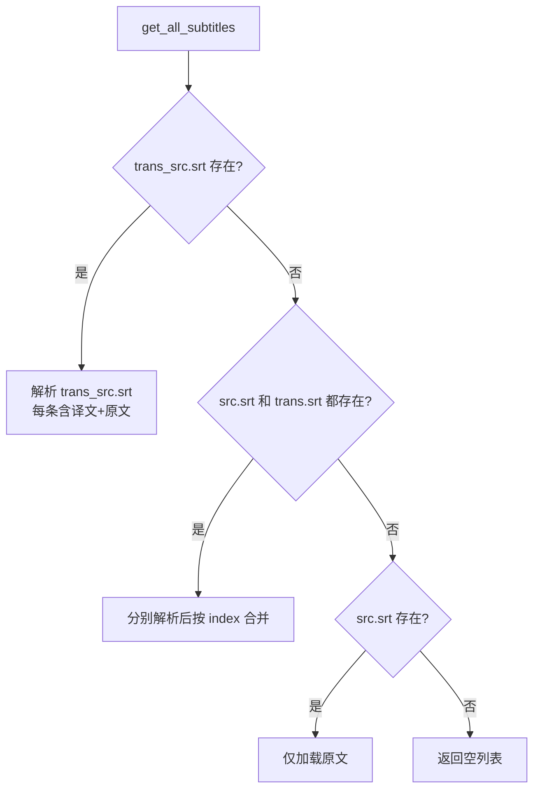

---

## 时序图

### 完整编辑流程

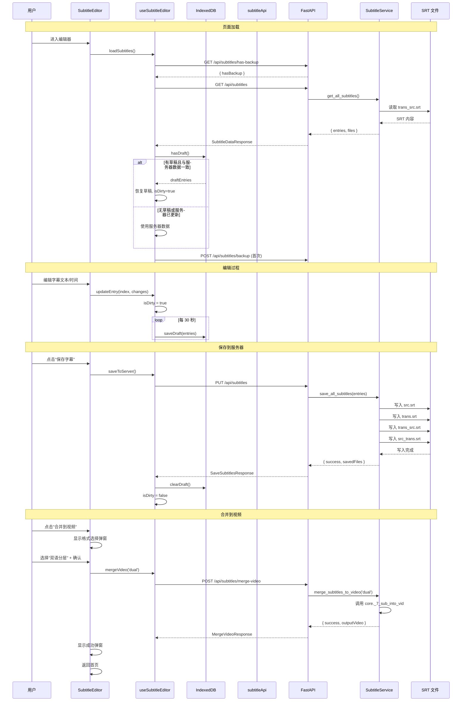

### 还原流程

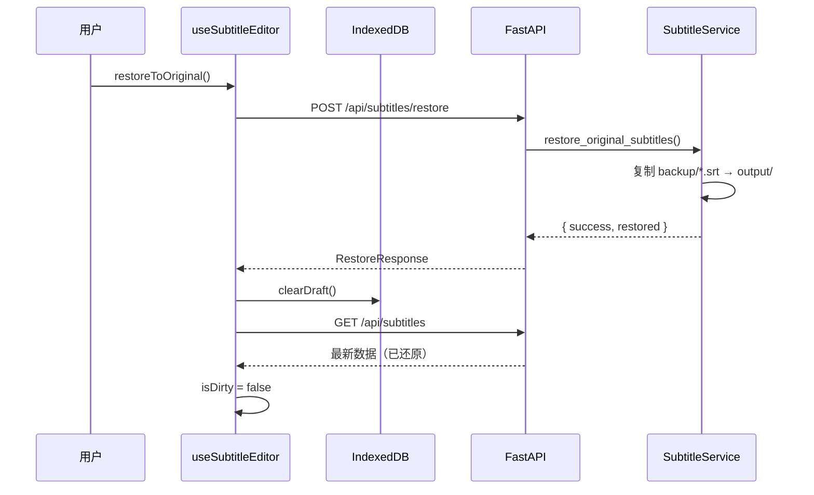

---

## 技术细节

### VideoSync 字幕渲染

VideoSync 使用 CSS 定位在视频上叠加渲染字幕预览：

| 元素 | 样式属性 |
|------|---------|
| 译文（主字幕） | `fontSize`, `fontColor`, `bgColor`, `outlineWidth`, `outlineColor` |
| 原文（副字幕） | 相同属性，默认较小字号和较浅颜色 |
| 布局 | `marginBottom`（底部边距）, `lineSpacing`（行间距） |

默认样式：

| 属性 | 译文 | 原文 |
|------|------|------|
| 字体大小 | 18px | 14px |
| 字体颜色 | #FFFFFF | #CCCCCC |
| 背景色 | rgba(0,0,0,0.75) | rgba(0,0,0,0.6) |
| 描边 | 1px #000000 | 1px #000000 |
| 底部边距 | 40px | - |
| 行间距 | 8px | - |

### SubtitleList 时间格式解析

支持多种时间格式输入：

| 格式 | 示例 | 说明 |
|------|------|------|
| `HH:MM:SS,mmm` | `00:01:23,456` | 标准 SRT 格式 |
| `HH:MM:SS.mmm` | `00:01:23.456` | 点号分隔毫秒 |
| `MM:SS.mmm` | `1:23.456` | 省略小时 |
| `MM:SS` | `1:23` | 省略毫秒 |

### Timeline 区域管理

Timeline 组件维护两个 Map 来管理字幕条目与 WaveSurfer 区域的映射：

```
regionMapRef: Map<regionId, entryIndex>   // 区域ID → 字幕索引
indexToRegionRef: Map<entryIndex, regionId> // 字幕索引 → 区域ID
```

更新策略：当 `entries` 或 `selectedIndex` 变化时，清除所有区域并重新创建。使用 `isUpdatingRegionsRef` 标志防止重建过程中触发 `region-created` 事件。

### FFmpeg 路径转义

Windows 环境下 FFmpeg 字幕滤镜的路径需要特殊转义：

```python
def _escape_ffmpeg_path(self, path: str) -> str:
    # 反斜杠 → 正斜杠
    escaped = str(path).replace("\\", "/")
    # 盘符冒号转义: D: → D\:
    if len(escaped) >= 2 and escaped[1] == ":":
        escaped = escaped[0] + "\\:" + escaped[2:]
    return escaped
```

### 技术栈

| 层级 | 技术 | 用途 |
|------|------|------|
| 视频播放 | HTML5 `<video>` | 视频流播放、时间同步 |
| 波形渲染 | WaveSurfer.js | 音频可视化 |
| 区域管理 | WaveSurfer RegionsPlugin | 字幕时间段拖拽 |
| 时间刻度 | WaveSurfer TimelinePlugin | 时间标记 |
| 本地存储 | IndexedDB (`idb` 库) | 草稿自动保存 |
| UI 组件 | Ant Design 5.x | 表单、弹窗、按钮 |
| 样式 | TailwindCSS 3.4 | 布局和视觉效果 |
| 国际化 | react-i18next | 多语言支持 |
| 视频处理 | FFmpeg + OpenCV | 字幕烧录 |
| API 框架 | FastAPI | 后端路由 |
